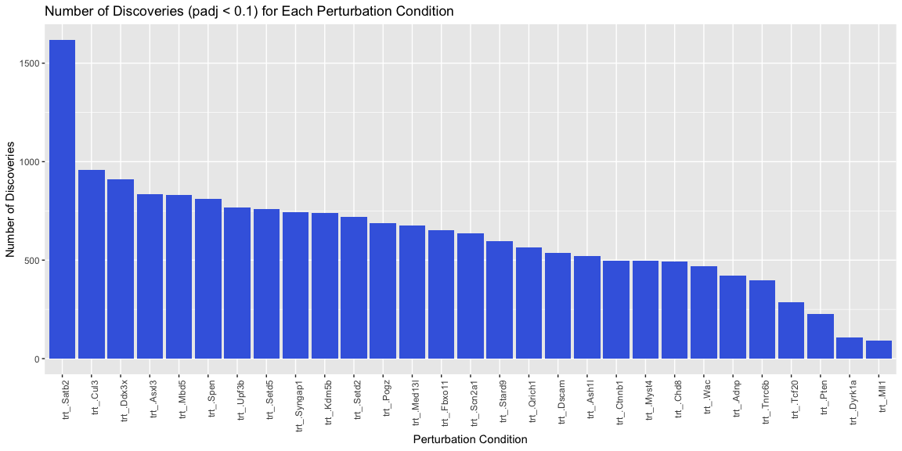

# Joint Pertub-seq perturbations analysis

The original data of Jin et al 2020 can be downloaded from the Broad
single cell portal
(<https://singlecell.broadinstitute.org/single_cell/study/SCP1184>).
Here, we just use a subset of the data to demonstrate the workflow of
the analysis.

``` r
library(Seurat)
```

    ## Loading required package: SeuratObject

    ## Loading required package: sp

    ## 'SeuratObject' was built under R 4.4.1 but the current version is
    ## 4.4.2; it is recomended that you reinstall 'SeuratObject' as the ABI
    ## for R may have changed

    ## 'SeuratObject' was built with package 'Matrix' 1.6.5 but the current
    ## version is 1.7.2; it is recomended that you reinstall 'SeuratObject' as
    ## the ABI for 'Matrix' may have changed

    ## 
    ## Attaching package: 'SeuratObject'

    ## The following objects are masked from 'package:base':
    ## 
    ##     intersect, t

``` r
library(caret)
```

    ## Loading required package: ggplot2

    ## Loading required package: lattice

``` r
sc.seurat <- readRDS("perturbseq-exneu.rds")

Y <- data.frame(t(sc.seurat[['RNA']]$counts)) # cell-by-gene matrix
metadata <- sc.seurat@meta.data

perturb <- metadata
colnames(perturb) <- gsub("Perturbation", "trt_", colnames(perturb))
perturb$trt_ <- relevel(as.factor(perturb$trt_), ref = "GFP")
dmy <- dummyVars(" ~ trt_", data = perturb)
A <- data.frame(predict(dmy, newdata = perturb))[,-1] # cell-by-trt matrix
```

For running causarray, we require the following inputs:

-   `Y`: the cell-by-gene gene expression matrix.
-   `A`: the cell-by-condition binary matrix of the
    perturbation/treatment conditions.
-   `X, X_A`: (optional) the cell-by-covariate matrix of the covariates
    of interest for outcome and propensity models.

Here, `Y` and `A` can be dataframes.

Use R package `reticulate` to load the Python package `causarray`.

``` r
require(reticulate)
```

    ## Loading required package: reticulate

``` r
Sys.setenv(PYTHONUNBUFFERED = TRUE)
use_condaenv('causarray')
causarray <- import("causarray")
cat(causarray$`__version__`)
```

    ## 0.0.1

``` r
# (Y, A) should be either data.frame or matrix
# optional covariates can be provided as matrices
dat <- causarray$prep_causarray_data(Y, A)
names(dat) <- c("Y", "A", "X", "X_A")
list2env(dat, .GlobalEnv)
```

    ## <environment: R_GlobalEnv>

We first apply gcate to estimate unmeasured confounders.

``` r
r <- 10
res_gate <- causarray$fit_gcate(Y, X, A, r, verbose=TRUE) # a list of results from 2 stages optimization
```

    ## 'Estimating dispersion parameter...'
    ## 'Fitting poisson GLM with offset...'
    ## {'d': 30, 'n': 2926, 'p': 3221, 'r': 10}
    ## 'Estimating initial latent variables with GLMs...'
    ## 'Fitting nb GLM with offset...'
    ## 'Estimating initial coefficients with GLMs...'
    ## 'Fitting nb GLM with offset...'
    ## {'kwargs_es': {'max_iters': 500,
    ##                'patience': 5,
    ##                'tolerance': 0.001,
    ##                'warmup': 0},
    ##  'kwargs_glm': {'disp_glm': array([ 1.47414891,  3.00517016,  0.64800909, ..., 12.75504916,
    ##        18.60623345, 11.39534142]),
    ##                 'family': 'nb',
    ##                 'size_factor': array([0.53193358, 0.87362742, 1.2235467 , ..., 0.5593801 , 0.73025856,
    ##        0.77857223])},
    ##  'kwargs_ls': {'C': 1000.0,
    ##                'alpha': 0.1,
    ##                'beta': 0.5,
    ##                'max_iters': 20,
    ##                'tol': 0.0001}}
    ## {'d': 30, 'n': 2926, 'p': 3221, 'r': 10}
    ## {'kwargs_es': {'max_iters': 500,
    ##                'patience': 5,
    ##                'tolerance': 0.001,
    ##                'warmup': 0},
    ##  'kwargs_glm': {'disp_glm': array([ 1.47414891,  3.00517016,  0.64800909, ..., 12.75504916,
    ##        18.60623345, 11.39534142]),
    ##                 'family': 'nb',
    ##                 'size_factor': array([0.53193358, 0.87362742, 1.2235467 , ..., 0.5593801 , 0.73025856,
    ##        0.77857223])},
    ##  'kwargs_ls': {'C': 1000.0,
    ##                'alpha': 0.1,
    ##                'beta': 0.5,
    ##                'max_iters': 20,
    ##                'tol': 0.0001}}

``` r
U <- res_gate[[2]]$U
```

Next, we apply causarray to estimate the causal effects of perturbations
on gene expression.

``` r
offsets <- log(res_gate[[2]][['kwargs_glm']][['size_factor']]) # use the precomputed size factors
res <- causarray$LFC(Y, cbind(X, U), A, cbind(X_A, U), offset=offsets, verbose=TRUE)
```

    ## 'Estimating LFC...'
    ## {'a': 29, 'd': 11, 'd_A': 12, 'estimands': 'LFC', 'n': 2926, 'p': 3221}
    ## {'C': 1.0,
    ##  'class_weight': 'balanced',
    ##  'fit_intercept': False,
    ##  'random_state': 0}
    ## {'offset': array([-0.63123664, -0.13510128,  0.20175377, ..., -0.58092607,
    ##        -0.31435661, -0.25029351]),
    ##  'random_state': 0}
    ## 'Fitting poisson GLM with offset...'
    ## 'Fitting nb GLM with offset...'

``` r
names(res) <- c("df_res", "estimation")
list2env(res, .GlobalEnv)
```

    ## <environment: R_GlobalEnv>

``` r
library(dplyr)
```

    ## 
    ## Attaching package: 'dplyr'

    ## The following objects are masked from 'package:stats':
    ## 
    ##     filter, lag

    ## The following objects are masked from 'package:base':
    ## 
    ##     intersect, setdiff, setequal, union

``` r
library(ggplot2)

# Filter the results for significant discoveries
significant_discoveries <- df_res[df_res$padj < 0.1, ]

# Count the number of discoveries for each perturbation condition
discovery_counts <- as.data.frame(table(significant_discoveries$trt))
colnames(discovery_counts) <- c('Perturbation', 'Count')

# Order the discovery_counts by Count in descending order
discovery_counts <- discovery_counts %>% arrange(desc(Count))

# Set the factor levels of Perturbation to ensure ggplot respects the order
discovery_counts$Perturbation <- factor(discovery_counts$Perturbation, levels = discovery_counts$Perturbation)

# Plot the number of discoveries for each perturbation condition
ggplot(discovery_counts, aes(x = Perturbation, y = Count)) +
  geom_bar(stat = "identity", fill = "royalblue") +  theme(axis.text.x = element_text(angle = 90, hjust = 1)) +
  ggtitle('Number of Discoveries (padj < 0.1) for Each Perturbation Condition') +
  xlab('Perturbation Condition') +
  ylab('Number of Discoveries')
```


