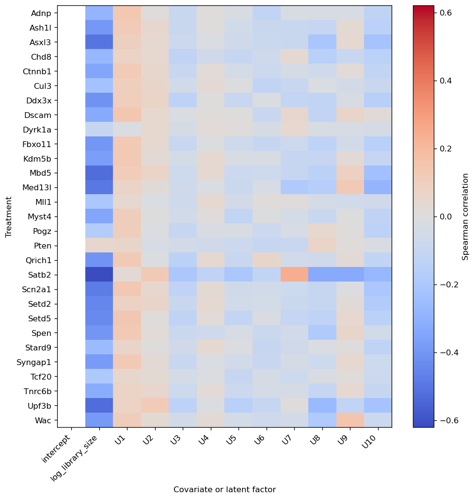
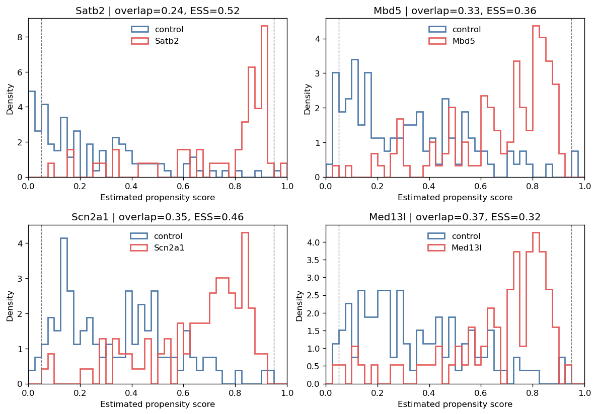
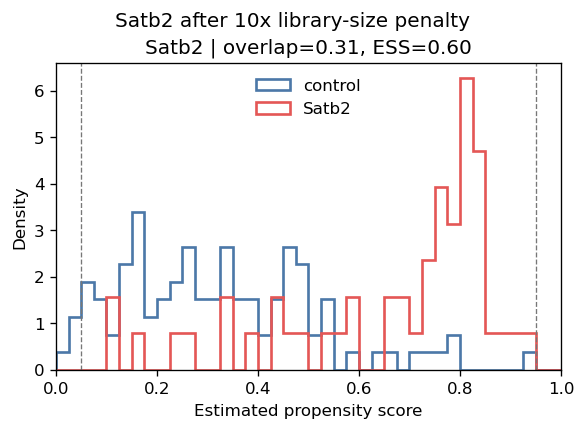
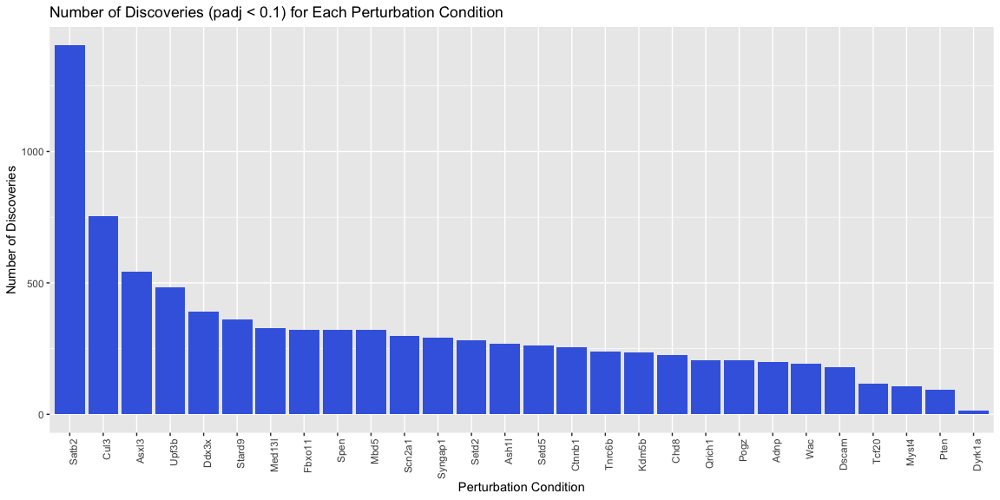

Perturb-seq Tutorial (R)
========================

The original data of Jin et al 2020 can be downloaded from the Broad
single cell portal
(<https://singlecell.broadinstitute.org/single_cell/study/SCP1184>).
Here, we just use a subset of the data to demonstrate the workflow of
the analysis.

``` r
library(Seurat)
```

    ## Loading required package: SeuratObject

    ## Loading required package: sp

    ## 
    ## Attaching package: 'SeuratObject'

    ## The following objects are masked from 'package:base':
    ## 
    ##     intersect, t

``` r
sc.seurat <- readRDS("perturbseq-exneu.rds")

# Access the counts through Seurat when its installed version recognizes the
# serialized Assay5 object; otherwise recover the same layer and dimnames
# directly. The fallback keeps this tutorial runnable with older Seurat builds.
if ("RNA" %in% Assays(sc.seurat)) {
  counts <- GetAssayData(sc.seurat, assay = "RNA", layer = "counts")
} else {
  rna.assay <- sc.seurat@assays[["RNA"]]
  counts <- rna.assay@layers[["counts"]]
  rownames(counts) <- rownames(rna.assay@features)
  colnames(counts) <- rownames(rna.assay@cells)
}
Y <- data.frame(t(as.matrix(counts)), check.names = FALSE) # cell-by-gene matrix
metadata <- sc.seurat@meta.data

perturb <- metadata
colnames(perturb) <- gsub("Perturbation", "trt_", colnames(perturb))
perturb$trt_ <- relevel(as.factor(perturb$trt_), ref = "GFP")
A <- data.frame(
  model.matrix(~ trt_ - 1, data = perturb)[, -1, drop = FALSE],
  check.names = FALSE
) # cell-by-trt matrix; remove the first (GFP control) column
colnames(A) <- sub("^trt_", "", colnames(A))
```

For running causarray, we require the following inputs:

-   `Y`: the cell-by-gene gene expression matrix.
-   `A`: the cell-by-condition binary matrix of the
    perturbation/treatment conditions.
-   `X, X_A`: (optional) the cell-by-covariate matrix of the covariates
    of interest for outcome and propensity models.

Here, `Y` and `A` can be dataframes.

Use R package `reticulate` to load the Python package `causarray`.
Render this tutorial from the `causarray-r` environment defined by
`environment-r.yaml`; reticulate then connects to the NumPy-2-based
Python `causarray` environment.

``` r
require(reticulate)
```

    ## Loading required package: reticulate

``` r
Sys.setenv(PYTHONUNBUFFERED = TRUE)
use_condaenv('causarray')
causarray <- import("causarray")
cat(causarray$`__version__`)
```

    ## 0.0.8

``` r
# (Y, A) should be either data.frame or matrix
# optional covariates can be provided as matrices
dat <- causarray$prep_causarray_data(Y, A)
names(dat) <- c("Y", "A", "X", "X_A")
list2env(dat, .GlobalEnv)
```

    ## <environment: R_GlobalEnv>

We first apply gcate to estimate unmeasured confounders.

``` r
r <- 10
res_gate <- causarray$fit_gcate(Y, X, A, r, verbose=TRUE) # a list of results from 2 stages optimization
```

    ## {'d': 30, 'n': 2926, 'p': 3221, 'r': 10}
    ## 'Estimating initial latent variables with GLMs...'
    ## 'Fitting nb GLM (fast)...'
    ## 'Estimating initial coefficients with GLMs...'
    ## 'Fitting nb GLM (fast)...'
    ## {'kwargs_es': {'max_iters': 50,
    ##                'patience': 5,
    ##                'rel_tol': 0.0002,
    ##                'tolerance': 0.0,
    ##                'warmup': 0},
    ##  'kwargs_glm': {'disp_glm': array([ 1.11673516,  1.06870944,  1.16716468, ..., 12.58818245,
    ##        16.46897663,  1.70852614], shape=(3221,)),
    ##                 'family': 'nb',
    ##                 'size_factor': array([0.53193358, 0.87362742, 1.2235467 , ..., 0.5593801 , 0.73025856,
    ##        0.77857223], shape=(2926,))},
    ##  'kwargs_ls': {'C': 1000.0,
    ##                'alpha': 0.1,
    ##                'beta': 0.5,
    ##                'max_iters': 20,
    ##                'recheck_interval': 10,
    ##                'sparsity_boost': 2.0,
    ##                'sparsity_threshold': 0.5,
    ##                'tol': 0.0001,
    ##                'tol_cell': 0.0001,
    ##                'tol_gene': 0.0001,
    ##                'warmup_iters': 0}}
    ## 'Fitting GCATE (step 1)...'
    ## {'d': 30, 'n': 2926, 'p': 3221, 'r': 10}
    ## {'kwargs_es': {'max_iters': 50,
    ##                'patience': 5,
    ##                'rel_tol': 0.0002,
    ##                'tolerance': 0.0,
    ##                'warmup': 0},
    ##  'kwargs_glm': {'disp_glm': array([ 1.11673516,  1.06870944,  1.16716468, ..., 12.58818245,
    ##        16.46897663,  1.70852614], shape=(3221,)),
    ##                 'family': 'nb',
    ##                 'size_factor': array([0.53193358, 0.87362742, 1.2235467 , ..., 0.5593801 , 0.73025856,
    ##        0.77857223], shape=(2926,))},
    ##  'kwargs_ls': {'C': 1000.0,
    ##                'alpha': 0.1,
    ##                'beta': 0.5,
    ##                'max_iters': 20,
    ##                'recheck_interval': 10,
    ##                'sparsity_boost': 2.0,
    ##                'sparsity_threshold': 0.5,
    ##                'tol': 0.0001,
    ##                'tol_cell': 0.0001,
    ##                'tol_gene': 0.0001,
    ##                'warmup_iters': 0}}
    ## 'Fitting GCATE (step 2)...'

``` r
U <- res_gate[[2]]$U
```

Next, we apply causarray to estimate the causal effects of perturbations
on gene expression. Here the 106 GFP control cells and the perturbation
groups (median 89 cells) are approximately balanced. We therefore use
pooled variance to retain power in this relatively small comparison.
This is a dataset-specific choice: unequal variance remains preferable
when arm sizes or effective sample sizes are meaningfully unbalanced,
when pseudo-outcome variability differs between arms, and for the
Replogle and case-control tutorials.

``` r
offsets <- log(res_gate[[2]][['kwargs_glm']][['size_factor']]) # use the precomputed size factors
res <- causarray$LFC(Y, cbind(X, U), A, cbind(X_A, U), offset=offsets,
                    usevar="pooled", verbose=TRUE)
```

    ## 'Estimating LFC...'
    ## {'a': 29, 'd': 11, 'd_A': 12, 'estimands': 'LFC', 'n': 2926, 'p': 3221}
    ## {'offset': array([-0.63123664, -0.13510128,  0.20175377, ..., -0.58092607,
    ##        -0.31435661, -0.25029351], shape=(2926,)),
    ##  'random_state': 0,
    ##  'verbose': True}
    ## 'Fit propensity score models...'
    ## {'C': 1.0,
    ##  'class_weight': 'balanced',
    ##  'fit_intercept': False,
    ##  'random_state': 0,
    ##  'verbose': False}
    ## 'Fit outcome models...'
    ## 'Fitting nb GLM (fast)...'
    ## ('Fast GLM coefficients exceed bound (max|B|=1.63e+05 > 1e+04); falling back '
    ##  'to statsmodels...')
    ## 'Estimating dispersion parameter...'
    ## 'Fitting poisson GLM with offset...'
    ## 'Fitting nb GLM with offset...'
    ## 'Fitting GLM done.'
    ## 'Estimating AIPW mean...'

``` r
names(res) <- c("df_res", "estimation")
list2env(res, .GlobalEnv)
```

    ## <environment: R_GlobalEnv>

Diagnose treatment associations and overlap
-------------------------------------------

Positivity requires treatment and control cells with comparable
covariates. The propensity design contains both observed covariates
created by `prep_causarray_data` (the intercept and standardized
log-library size) and the estimated latent factors. The association
summary compares each perturbation with the shared all-zero GFP
controls. These statistics are diagnostics: an observed confounder
should not be removed merely because it is associated with treatment.

``` r
W_A <- cbind(X_A, U)
factor_names <- paste0("U", seq_len(ncol(U)))
propensity_names <- c("intercept", "log_library_size", factor_names)
propensity_types <- c("observed", "observed", rep("latent", ncol(U)))

association_summary <- causarray$summarize_treatment_associations(
  A, W_A,
  covariate_names = propensity_names,
  covariate_types = propensity_types
)
observed_associations <- subset(
  association_summary, covariate_type == "observed" & !constant
)
observed_associations <- observed_associations[
  order(observed_associations$padj),
]
head(observed_associations, 10)
```

    ##     treatment        covariate covariate_type n_control n_treated spearman_rho
    ## 218     Satb2 log_library_size       observed       106        51   -0.6206012
    ## 134      Mbd5 log_library_size       observed       106       119   -0.5251680
    ## 26      Asxl3 log_library_size       observed       106       130   -0.5011708
    ## 326     Upf3b log_library_size       observed       106       100   -0.5244644
    ## 230    Scn2a1 log_library_size       observed       106        93   -0.4791687
    ## 146    Med13l log_library_size       observed       106        75   -0.4911242
    ## 242     Setd2 log_library_size       observed       106        76   -0.4504232
    ## 14      Ash1l log_library_size       observed       106       122   -0.3905315
    ## 254     Setd5 log_library_size       observed       106        71   -0.4383442
    ## 110    Fbxo11 log_library_size       observed       106       111   -0.3943441
    ##           pvalue         padj standardized_mean_difference constant
    ## 218 4.352985e-18 1.388602e-15                   -1.6704318    FALSE
    ## 134 2.377952e-17 3.792833e-15                   -1.1965476    FALSE
    ## 26  2.061826e-16 2.192409e-14                   -1.1478666    FALSE
    ## 326 5.917208e-16 4.718973e-14                   -1.1938053    FALSE
    ## 230 8.091610e-13 5.162447e-11                   -1.0708596    FALSE
    ## 146 2.226940e-12 1.183990e-10                   -1.0729179    FALSE
    ## 242 1.771080e-10 8.071064e-09                   -0.9716459    FALSE
    ## 14  1.003845e-09 3.710293e-08                   -0.8068996    FALSE
    ## 254 1.046791e-09 3.710293e-08                   -0.9526579    FALSE
    ## 110 1.730357e-09 5.519838e-08                   -0.8442098    FALSE

``` r
latent_associations <- subset(
  association_summary, covariate_type == "latent"
)
latent_associations$abs_smd <- abs(
  latent_associations$standardized_mean_difference
)
latent_associations <- latent_associations[
  order(-latent_associations$abs_smd),
]
head(subset(latent_associations, select = -abs_smd), 10)
```

    ##     treatment covariate covariate_type n_control n_treated spearman_rho
    ## 227     Satb2        U9         latent       106        51   -0.3265056
    ## 228     Satb2       U10         latent       106        51   -0.2745888
    ## 156    Med13l       U10         latent       106        75   -0.2846287
    ## 226     Satb2        U8         latent       106        51   -0.3265056
    ## 144      Mbd5       U10         latent       106       119   -0.2341390
    ## 153    Med13l        U7         latent       106        75   -0.1824543
    ## 36      Asxl3       U10         latent       106       130   -0.2183243
    ## 225     Satb2        U7         latent       106        51    0.2460796
    ## 240    Scn2a1       U10         latent       106        93   -0.2018013
    ## 336     Upf3b       U10         latent       106       100   -0.2200104
    ##           pvalue         padj standardized_mean_difference constant
    ## 227 3.001268e-05 0.0003989185                   -0.7342411    FALSE
    ## 228 5.009732e-04 0.0053270147                   -0.6212857    FALSE
    ## 156 1.030101e-04 0.0013144089                   -0.5894248    FALSE
    ## 226 3.001268e-05 0.0003989185                   -0.5629788    FALSE
    ## 144 3.972790e-04 0.0043700685                   -0.4686546    FALSE
    ## 153 1.395825e-02 0.1086020002                   -0.4680370    FALSE
    ## 36  7.328527e-04 0.0075412907                   -0.4481183    FALSE
    ## 225 1.892240e-03 0.0177536596                    0.4434756    FALSE
    ## 240 4.259310e-03 0.0377422207                   -0.4039392    FALSE
    ## 336 1.485232e-03 0.0143572436                   -0.3873724    FALSE

``` r
dir.create(
  "perturbseq-r_files/figure-markdown_github",
  recursive = TRUE, showWarnings = FALSE
)
association_plot <- causarray$plot_treatment_associations(
  association_summary
)
association_plot[[1]]$savefig(
  "perturbseq-r_files/figure-markdown_github/treatment-associations-1.png",
  dpi = 120L, bbox_inches = "tight"
)
knitr::asis_output(
  ""
)
```


We next estimate five-fold out-of-fold scores with the same balanced
logistic model used by `LFC`. The overlap ratio is descriptive rather
than a pass/fail threshold; the table also reports the fraction outside
`[0.05, 0.95]`, inverse- weight effective sample size (ESS), and Brier
score.

``` r
pi_oof <- causarray$estimate_propensity_scores(
  A, W_A, K = 5L, class_weight = "balanced", random_state = 0L
)
ps_summary <- causarray$summarize_propensity_scores(A, pi_oof)
ps_summary <- ps_summary[order(ps_summary$overlap_ratio),]
head(ps_summary, 10)
```

    ##    treatment n_control n_treated prevalence overlap_ratio       auc brier_score
    ## 19     Satb2       106        51  0.3248408     0.2388087 0.9076952   0.1158215
    ## 12      Mbd5       106       119  0.5288889     0.3274140 0.8625337   0.1518109
    ## 20    Scn2a1       106        93  0.4673367     0.3486508 0.8444918   0.1629961
    ## 13    Med13l       106        75  0.4143646     0.3659119 0.8401258   0.1642948
    ## 22     Setd5       106        71  0.4011299     0.3855966 0.8087962   0.1805291
    ## 28     Upf3b       106       100  0.4854369     0.3898113 0.8479245   0.1590119
    ## 3      Asxl3       106       130  0.5508475     0.3904209 0.8560232   0.1556060
    ## 21     Setd2       106        76  0.4175824     0.4217974 0.7868669   0.1878223
    ## 18    Qrich1       106        86  0.4479167     0.4589732 0.8094559   0.1813526
    ## 29       Wac       106        85  0.4450262     0.4640400 0.7641509   0.1998440
    ##    outside_overlap_fraction clipped_fraction ess_control ess_treated
    ## 19              0.140127389                0    23.26139    26.51445
    ## 12              0.053333333                0    27.72657    43.14009
    ## 20              0.015075377                0    52.53817    42.72273
    ## 13              0.022099448                0    65.90973    24.06093
    ## 22              0.005649718                0    55.73538    29.62051
    ## 28              0.024271845                0    60.87815    60.67224
    ## 3               0.025423729                0    51.51359   102.36937
    ## 21              0.010989011                0    51.74805    54.97803
    ## 18              0.000000000                0    72.62433    47.30067
    ## 29              0.000000000                0    66.27410    41.83878
    ##    ess_control_fraction ess_treated_fraction   score_q01 score_median score_q99
    ## 19            0.2194471            0.5198912 0.005015576    0.3313653 0.9509675
    ## 12            0.2615714            0.3625218 0.027025725    0.5270169 0.9180425
    ## 20            0.4956431            0.4593842 0.042570306    0.4874781 0.9134607
    ## 13            0.6217899            0.3208124 0.043012888    0.4760133 0.9082600
    ## 22            0.5258055            0.4171903 0.067022296    0.4470805 0.9269663
    ## 28            0.5743222            0.6067224 0.031873028    0.4878085 0.8977650
    ## 3             0.4859773            0.7874567 0.031346697    0.5379988 0.9047988
    ## 21            0.4881891            0.7233951 0.054742236    0.4722173 0.9050784
    ## 18            0.6851352            0.5500077 0.074137959    0.4962168 0.8494633
    ## 29            0.6252274            0.4922210 0.079766804    0.4631510 0.8911626

``` r
weakest <- head(ps_summary$treatment, 4)
propensity_plot <- causarray$plot_propensity_scores(
  A, pi_oof, treatments = as.list(weakest)
)
propensity_plot[[1]]$savefig(
  "perturbseq-r_files/figure-markdown_github/propensity-overlap-1.png",
  dpi = 120L, bbox_inches = "tight"
)
knitr::asis_output(
  ""
)
```


Satb2 has the weakest overlap. Its latent-factor diagnostics flag U9,
while standardized log-library size is also strongly associated with
this perturbation. We compare dropping U9 with retaining all covariates
and applying ten times the ordinary L2 penalty to library size only.
Each refit changes the Satb2 propensity model but preserves the other
treatment score columns. We check out-of-fold overlap after refitting
before reusing the primary fit’s cached outcome predictions for the
effect sensitivity analyses.

``` r
drop_by_treatment <- list(Satb2 = "U9")
library_penalty_factor <- 10
library_penalties <- list(
  Satb2 = list(log_library_size = library_penalty_factor)
)

oof_filtered <- causarray$refit_propensity_scores(
  A, W_A,
  drop_by_treatment = drop_by_treatment,
  pi_hat = pi_oof,
  covariate_names = propensity_names,
  K = 5L, class_weight = "balanced", random_state = 0L
)
pi_oof_filtered <- oof_filtered[[1]]
oof_filter_audit <- oof_filtered[[2]]

oof_library_regularized <- causarray$refit_propensity_scores(
  A, W_A,
  pi_hat = pi_oof,
  covariate_names = propensity_names,
  penalty_factors_by_treatment = library_penalties,
  K = 5L, class_weight = "balanced", random_state = 0L
)
pi_oof_library_regularized <- oof_library_regularized[[1]]
library_regularization_audit <- oof_library_regularized[[2]]
oof_filter_audit
```

    ##   treatment dropped_covariates
    ## 1     Satb2                 U9
    ##                                                retained_covariates
    ## 1 intercept, log_library_size, U1, U2, U3, U4, U5, U6, U7, U8, U10
    ##   penalty_factors n_retained
    ## 1            NULL         11

``` r
library_regularization_audit
```

    ##   treatment dropped_covariates
    ## 1     Satb2               NULL
    ##                                                    retained_covariates
    ## 1 intercept, log_library_size, U1, U2, U3, U4, U5, U6, U7, U8, U9, U10
    ##   penalty_factors n_retained
    ## 1              10         12

``` r
satb2_overlap <- rbind(
  transform(
    subset(causarray$summarize_propensity_scores(A, pi_oof),
           treatment == "Satb2"),
    model = "all factors"
  ),
  transform(
    subset(causarray$summarize_propensity_scores(A, pi_oof_filtered),
           treatment == "Satb2"),
    model = "drop U9"
  ),
  transform(
    subset(causarray$summarize_propensity_scores(
             A, pi_oof_library_regularized), treatment == "Satb2"),
    model = "10x library-size penalty"
  )
)
satb2_overlap[, c(
  "model", "overlap_ratio", "outside_overlap_fraction",
  "ess_control_fraction", "ess_treated_fraction", "brier_score"
)]
```

    ##                        model overlap_ratio outside_overlap_fraction
    ## 19               all factors     0.2388087               0.14012739
    ## 191                  drop U9     0.1735109               0.11464968
    ## 192 10x library-size penalty     0.3085461               0.02547771
    ##     ess_control_fraction ess_treated_fraction brier_score
    ## 19             0.2194471            0.5198912   0.1158215
    ## 191            0.2460715            0.5053637   0.1171930
    ## 192            0.4868185            0.5954587   0.1465261

``` r
regularized_plot <- causarray$plot_propensity_scores(
  A, pi_oof_library_regularized, treatments = list("Satb2")
)
invisible(regularized_plot[[1]]$suptitle(
  "Satb2 after 10x library-size penalty", y = 1.02
))
regularized_plot[[1]]$savefig(
  "perturbseq-r_files/figure-markdown_github/satb2-library-penalty-1.png",
  dpi = 120L, bbox_inches = "tight"
)
knitr::asis_output(
  ""
)
```


``` r
analysis_filtered <- causarray$refit_propensity_scores(
  A, W_A,
  drop_by_treatment = drop_by_treatment,
  pi_hat = estimation[["pi_hat_raw"]],
  covariate_names = propensity_names,
  K = 1L, class_weight = "balanced", random_state = 0L
)
analysis_library_regularized <- causarray$refit_propensity_scores(
  A, W_A,
  pi_hat = estimation[["pi_hat_raw"]],
  covariate_names = propensity_names,
  penalty_factors_by_treatment = library_penalties,
  K = 1L, class_weight = "balanced", random_state = 0L
)

filtered_fit <- causarray$LFC(
  Y, cbind(X, U), A, W_A,
  offset = offsets, usevar = "pooled",
  Y_hat = estimation[["Y_hat"]], pi_hat = analysis_filtered[[1]]
)
library_regularized_fit <- causarray$LFC(
  Y, cbind(X, U), A, W_A,
  offset = offsets, usevar = "pooled",
  Y_hat = estimation[["Y_hat"]],
  pi_hat = analysis_library_regularized[[1]]
)

satb2_all <- subset(
  df_res, trt == "Satb2", select = c(gene_names, tau, padj)
)
names(satb2_all)[-1] <- c("tau_all", "padj_all")
satb2_filtered <- subset(
  filtered_fit[[1]], trt == "Satb2",
  select = c(gene_names, tau, padj)
)
names(satb2_filtered)[-1] <- c("tau_drop_u9", "padj_drop_u9")
satb2_library <- subset(
  library_regularized_fit[[1]], trt == "Satb2",
  select = c(gene_names, tau, padj)
)
names(satb2_library)[-1] <- c(
  "tau_library_penalty", "padj_library_penalty"
)
satb2_effects <- Reduce(
  function(left, right) merge(left, right, by = "gene_names"),
  list(satb2_all, satb2_filtered, satb2_library)
)
sensitivity_summary <- data.frame(
  model = c("drop U9", "10x library-size penalty"),
  effect_correlation = c(
    cor(satb2_effects$tau_all, satb2_effects$tau_drop_u9),
    cor(satb2_effects$tau_all, satb2_effects$tau_library_penalty)
  ),
  median_absolute_change = c(
    median(abs(satb2_effects$tau_all - satb2_effects$tau_drop_u9)),
    median(abs(satb2_effects$tau_all -
                 satb2_effects$tau_library_penalty))
  ),
  discoveries = c(
    sum(satb2_effects$padj_drop_u9 < 0.1, na.rm = TRUE),
    sum(satb2_effects$padj_library_penalty < 0.1, na.rm = TRUE)
  ),
  discoveries_all = sum(satb2_effects$padj_all < 0.1, na.rm = TRUE)
)
sensitivity_summary
```

    ##                      model effect_correlation median_absolute_change
    ## 1                  drop U9          0.9978495             0.01127664
    ## 2 10x library-size penalty          0.9851398             0.01772560
    ##   discoveries discoveries_all
    ## 1        1395            1404
    ## 2        1351            1404

``` r
baseline_overlap <- subset(satb2_overlap, model == "all factors")
regularized_overlap <- subset(
  satb2_overlap, model == "10x library-size penalty"
)
regularized_effects <- subset(
  sensitivity_summary, model == "10x library-size penalty"
)
```

**Sensitivity interpretation.** Applying a 10-fold L2 penalty to library
size alone raises Satb2’s overlap ratio from 0.239 to 0.309, reduces the
fraction outside `[0.05, 0.95]` from 14.0% to 2.5%, and raises the
control ESS fraction from 21.9% to 48.7%. Its out-of-fold Brier score
changes from 0.116 to 0.147, indicating that the overlap gain reflects
stronger smoothing rather than better out-of-fold propensity prediction.
The corresponding effects remain highly similar overall (correlation
0.985), and the change in discoveries from 1,404 to 1,351 is acceptable
for this regularized sensitivity analysis rather than evidence of
substantive instability. We retain the original propensity specification
as the primary analysis and report both filtered specifications as
sensitivities; neither establishes positivity that is absent in the
data.

``` r
library(dplyr)
```

    ## 
    ## Attaching package: 'dplyr'

    ## The following objects are masked from 'package:stats':
    ## 
    ##     filter, lag

    ## The following objects are masked from 'package:base':
    ## 
    ##     intersect, setdiff, setequal, union

``` r
library(ggplot2)

# Filter the results for significant discoveries
significant_discoveries <- df_res[df_res$padj < 0.1, ]

# Count the number of discoveries for each perturbation condition
discovery_counts <- as.data.frame(table(significant_discoveries$trt))
colnames(discovery_counts) <- c('Perturbation', 'Count')

# Order the discovery_counts by Count in descending order
discovery_counts <- discovery_counts %>% arrange(desc(Count))

# Set the factor levels of Perturbation to ensure ggplot respects the order
discovery_counts$Perturbation <- factor(discovery_counts$Perturbation, levels = discovery_counts$Perturbation)

# Plot the number of discoveries for each perturbation condition
ggplot(discovery_counts, aes(x = Perturbation, y = Count)) +
  geom_bar(stat = "identity", fill = "royalblue") +  theme(axis.text.x = element_text(angle = 90, hjust = 1)) +
  ggtitle('Number of Discoveries (padj < 0.1) for Each Perturbation Condition') +
  xlab('Perturbation Condition') +
  ylab('Number of Discoveries')
```


